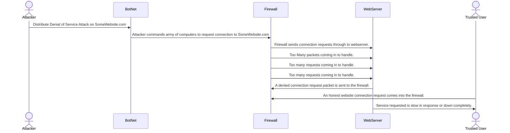

```mermaid
sequenceDiagram
  actor Attacker
  participant BotNet
  participant Firewall
  participant WebServer
  actor Trusted User
  Attacker->>BotNet: Distribute Denial of Service Attack on SomeWebsite.com
  BotNet->>Firewall: Attacker commands army of computers to request connection to SomeWebsite.com
  Firewall->>WebServer: Firewall sends connection requests through to webserver.
  Firewall->>WebServer: Too Many packets coming in to handle.
  Firewall->>WebServer: Too many requests coming in to handle.
  Firewall->>WebServer: Too many requests coming in to handle.
  WebServer->>Firewall: A denied connection request packet is sent to the firewall.
  Trusted User->>Firewall: An honest website connection request comes into the firewall.
  WebServer->>Trusted User: Service requested is slow in response or down completely.


```
