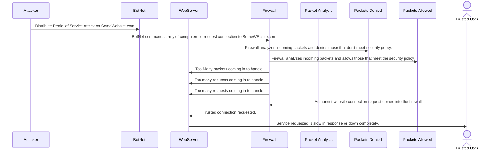

```mermaid
sequenceDiagram
  participant Attacker
  participant BotNet
  participant WebServer
  participant Firewall
  participant Packet Analysis
  participant Packets Denied
  participant Packets Allowed
  actor Trusted User
  Attacker->>BotNet: Distribute Denial of Service Attack on SomeWebsite.com
  BotNet->>Firewall: BotNet commands army of computers to request connection to SomeWEbsite.com
  Firewall->>Packets Denied: Firewall analyzes incoming packets and denies those that don't meet security policy.
  Firewall->>Packets Allowed: Firewall analyzes incoming packets and allows those that meet the security policy.
  Firewall->>WebServer: Too Many packets coming in to handle.
  Firewall->>WebServer: Too many requests coming in to handle.
  Firewall->>WebServer: Too many requests coming in to handle.
  Trusted User->>Firewall: An honest website connection request comes into the firewall.
  Firewall->>WebServer: Trusted connection requested.
  WebServer->>Trusted User: Service requested is slow in response or down completely.


```
